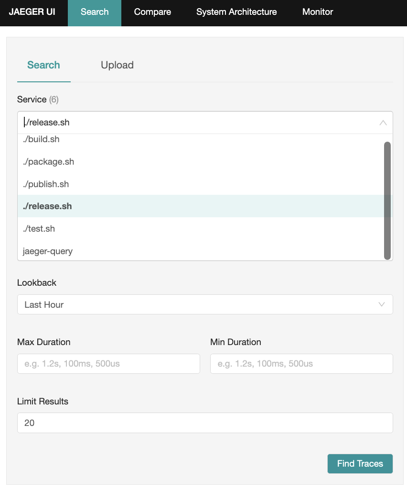
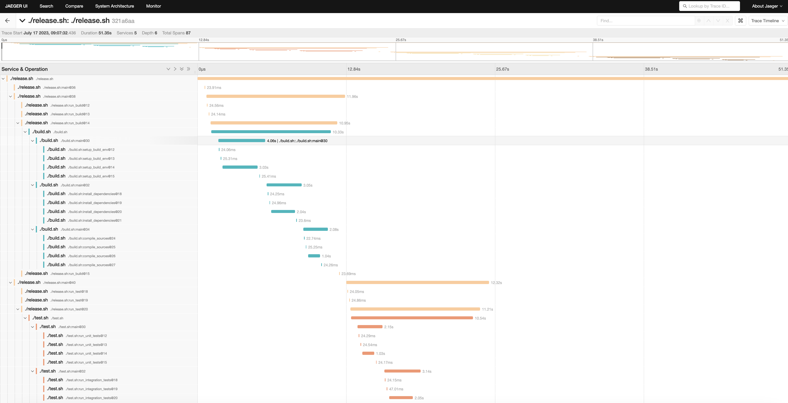

# Example - Release Process

This example presents how to instrument and trace a sample release pipeline (has `build`, `test`, `package` and `publish` phases) 
script with `otel-bash` automatically.

## Run With Jaeger

- Run Jaeger as OTLP HTTP/JSON endpoint active:
```bash
docker run -d --name jaeger -p 4318:4318 -p 16686:16686 jaegertracing/all-in-one:1.47
```

- Make sure that Jaeger works by opening Jaeger UI at [http://localhost:16686](http://localhost:16686)

- Run example with Jaeger OTLP HTTP/JSON endpoint config:
```bash
OTEL_EXPORTER_OTLP_ENDPOINT=http://localhost:4318 ./release.sh
```

- Search your traces in Jaeger UI


- And see your trace in Jaeger UI


## Run With OTEL SaaS Vendors

```bash
OTEL_EXPORTER_OTLP_ENDPOINT=<YOUR-OTEL-VENDOR-OTLP-ENDPOINT> \
OTEL_EXPORTER_OTLP_HEADERS=<YOUR-OTEL-VENDOR-API-AUTH-HEADER-NAME>=<YOUR-OTEL-VENDOR-API-AUTH-TOKEN> \
./release.sh
```
